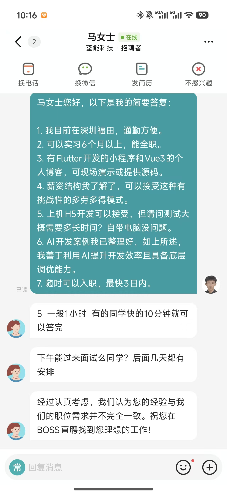

##### 这是这两天的汇总

由于对自己的简历过于乐观，上周第一次投递就有HR主动回复并要我简历，让我过度自信，因此从这周开始，我在BOSS直聘上开始了每天固定投递20个以上的岗位，不过总的来说，回复的大概只占5%吧，而且要求还高的一批，工资不高，要求是一点不低啊！

不招还好，只是看不起我而已，但最烦的就是把我当傻子耍（相关图片在最后），左右脑互博这一块，这明摆着就是要招我们这种没什么见识的来割韭菜

关于找实习的，首先，我原本的策略得坚持下去，坚持每天10-20个岗位的投递；其次，我得试着优化简历与我的话术，毕竟对面招一个实习生能润色得像是要一个行业大手子，那我也得跟上节奏啊

#### 帮同学装AI

初中老同学终于有空了，于是我马不停蹄地帮他安好了AI，已经非常熟练了，三两下就ok了，然后老同学是国际财务的，于是我两一起用AI写了个脚本去爬国外网站的信息，嗯，也是非常不赖！

#### 学习

怎么说，这个就是学习，有说法吗

